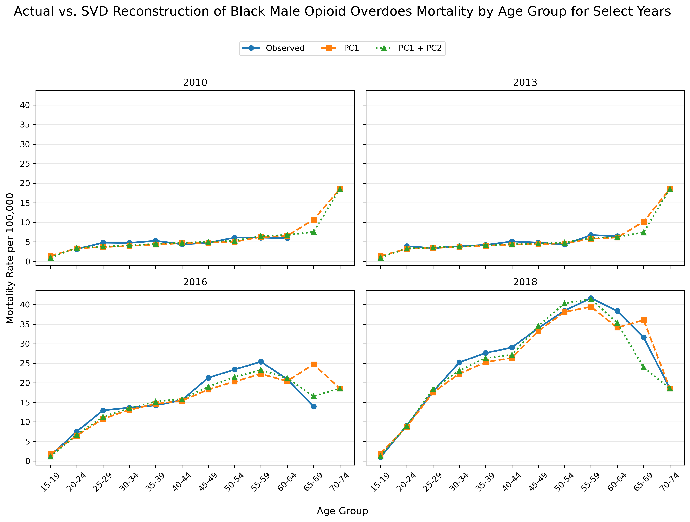
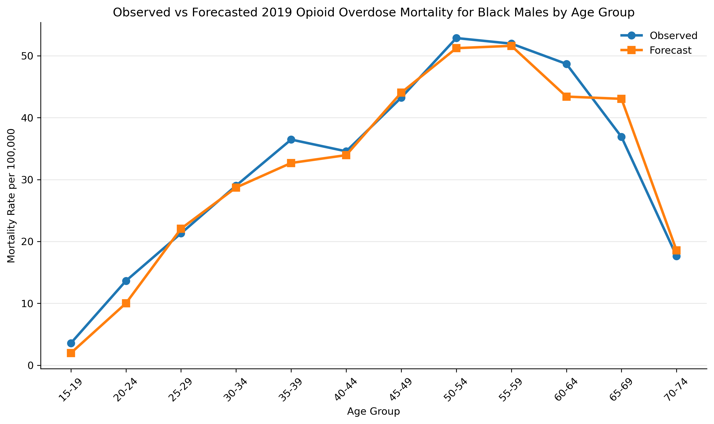
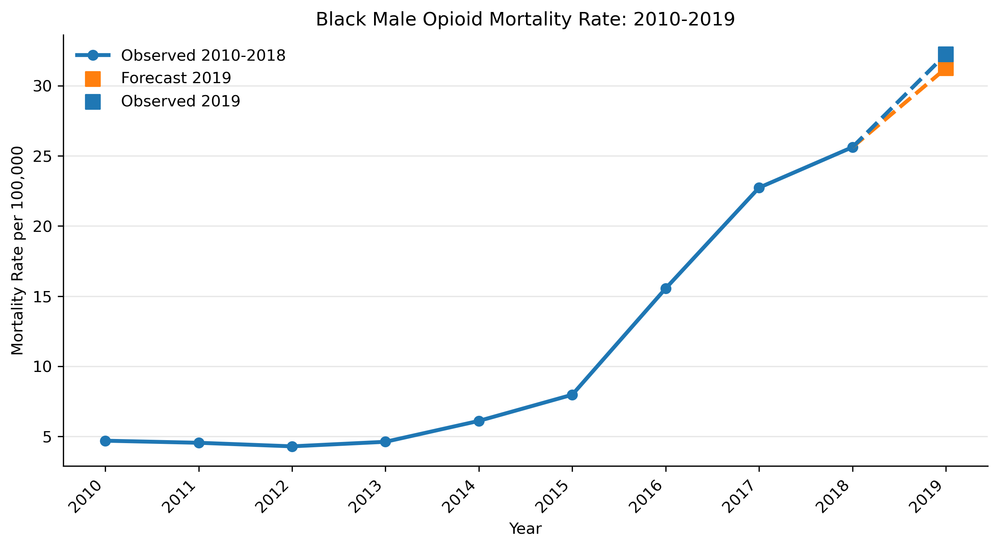
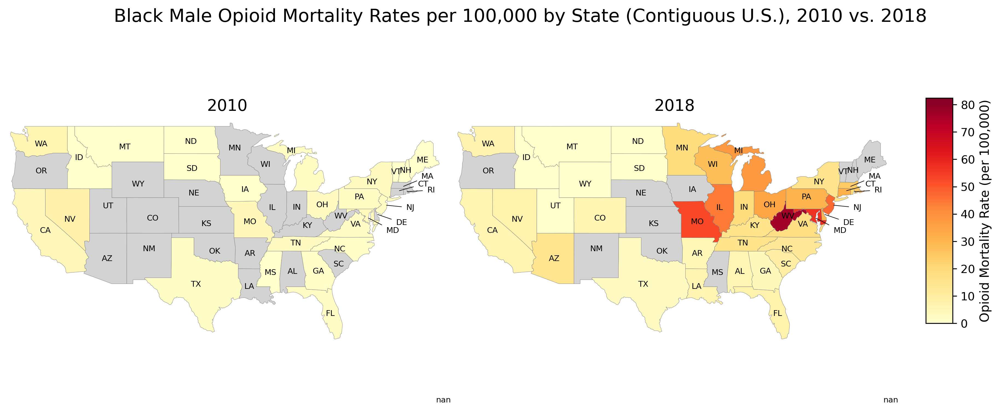

## Overview

Mortality data contains latent temporal and demographic structure that can be leveraged through dimensionality reduction techniques. This project applies Singular Value Decomposition (SVD) and time-series forecasting to model opioid overdose mortality patterns among Black males in the United States.

Using the Lee-Carter mortality modeling framework, a widely used approach in demographic forecasting, the analysis decomposes historical mortality curves from 2010–2018 into:

- baseline age-specific mortality patterns
- dominant temporal mortality trends
- age-specific sensitivities to mortality change

A one-year-ahead forecast is generated by applying an ARIMA model to the extracted mortality trend component. Forecast performance is evaluated by comparing predicted 2019 mortality rates against observed mortality rates at both the age-group and population-weighted aggregate levels.

---

# Key Results

The SVD decomposition identified a strong low-dimensional structure within opioid mortality patterns:

- The first principal component explained **91.6% of variation** in the log mortality surface.
- Low-dimensional SVD reconstruction preserved the overall shape of age-specific mortality curves.
- The ARIMA-based forecast produced a close approximation of observed 2019 aggregate mortality rates.

---

# Methodology

The analysis follows the Lee-Carter mortality modeling framework.

## 1. Data Preparation

- Mortality rates were calculated as deaths per 100,000 population.
- Age groups were aggregated into 5-year intervals to address sparsity in mortality observations.
- Mortality rates were transformed to the log scale to stabilize variation and ensure positive model outputs.

## 2. Dimensionality Reduction Using SVD

Historical log mortality rates were represented as an age-by-year matrix.

The average age-specific mortality pattern was removed, isolating year-to-year deviations from the baseline mortality curve. Singular Value Decomposition was then applied to extract latent mortality components:

\[
M = USV^T
\]

The dominant component captures the shared temporal mortality trend and the relative sensitivity of each age group to changes in that trend.

## 3. Time-Series Forecasting

The extracted mortality trend component was forecast one year ahead using an ARIMA model.

The forecasted trend was combined with the age-specific components to reconstruct the predicted 2019 mortality curve.

## 4. Model Evaluation

Predicted mortality rates were evaluated against observed 2019 mortality rates through:

- age-specific mortality curve comparisons
- population-weighted aggregate mortality comparisons
- SVD reconstruction analysis

---

# Results & Visualizations

## SVD Reconstruction of Mortality Patterns

The SVD decomposition demonstrates that mortality patterns can be represented using a small number of latent components while preserving the overall structure of age-specific mortality curves.

## 2019 Mortality Forecast by Age Group

The forecasted 2019 mortality curve tracks the observed age-specific mortality pattern, demonstrating the ability of the model to capture the overall shape of mortality risk across age groups.

## Population-Weighted Mortality Forecast

The aggregate mortality forecast compares historical mortality trends from 2010–2018 with the predicted and observed 2019 mortality rate.

## Geographic Distribution of Mortality

State-level mortality rates are visualized to demonstrate geographic variation and changes in opioid mortality patterns between 2010 and 2018.

---

# Data

Mortality and population data were obtained from **CDC WONDER** using underlying and multiple cause of death codes targeting prescription and synthetic opioid mortality.

Included opioid-related codes:

- Underlying cause of death:
  - X40–X44
  - X60–X64
  - X85
  - Y10–Y14

- Multiple cause of death:
  - T40.2
  - T40.3
  - T40.4

Geographic boundary data were used for state-level visualization.

---

# Future Extensions

Potential improvements include:

- expanding the training period to reduce stochastic variation from sparse mortality observations
- extending the analysis to more granular demographic subgroups where mortality experience may be even more sparse and would benefit from borrowing strength from latent structures identified in national-level mortality patterns

---

# Technologies

- Python
- NumPy
- Pandas
- Matplotlib
- Statsmodels
- Singular Value Decomposition
- ARIMA Time-Series Forecasting
- GeoPandas
